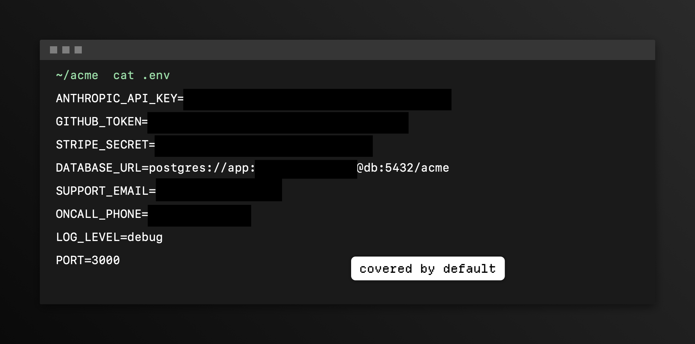
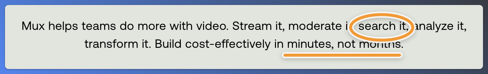

<p align="center">
  <picture>
    <source media="(prefers-color-scheme: dark)" srcset="assets/logo-dark.png">
    
  </picture>
</p>

<h1 align="center">shot</h1>

<p align="center"><b>Your agent takes the screenshot. You keep working.</b></p>

<p align="center">
  Capture, mark up, redact and find screenshots on macOS, from any MCP agent.<br>
  No app window. No stolen focus. No API keys in your bug reports.
</p>

<p align="center">
  <a href="https://github.com/davekiss/shot/releases"></a>
  
  
  <a href="LICENSE"></a>
</p>

---

You're deep in a bug with your agent, and it needs to see the window. So you stop typing, hit ⌘⇧4, drag a box, find the file, drag it into the chat. Later you want to share it, so you open an editor, draw an arrow, and squint at the corner to make sure your Stripe key isn't in it.

With shot, you say *"screenshot the checkout page and circle the error."* The agent finds the window, even if it's buried under six others or minimized to the Dock. It captures it without moving your cursor, points the arrow at the words "Payment failed", blacks out the API key it spotted in the console, and saves it where you'll find it next week.

You never left your keyboard.

<p align="center">
  
  <br>
  <sub>Made by shot with no flags at all: <code>compose</code> covers secrets by default. The variable names stay readable, and so does the database host.</sub>
</p>

## Get started

**Claude Code**: one install gets you the server, a skill that teaches Claude to use it well, and a `/shot` command.

```
/plugin marketplace add davekiss/shot
/plugin install shot@davekiss
```

**Codex, OpenCode, Cursor and every other MCP client**:

```sh
brew install davekiss/tap/shot
codex mcp add shot -- shot        # or see the configs below
```

Then grant your terminal **Screen Recording** permission (System Settings → Privacy & Security), and ask your agent for a screenshot.

## What it's good at

### It never takes your screen

shot captures in the background through macOS's own `screencapture`. Windows are found by app or title and captured whole, even when they're covered by other windows or minimized to the Dock. Your cursor, your focus and your typing are left alone.

> *"Grab the Simulator window."* · *"Screenshot every Chrome window."* · *"Capture the minimized Slack window."*

### It points at words, not pixels

Agents are bad at guessing coordinates from a downscaled preview. So shot lets them name the thing instead. Any annotation can take a `target`, and shot finds that text in the image and places the mark the way a person would: boxes around it, numbered steps on its corner, labels underneath, arrows coming in from open space instead of through the paragraph next to it.

```json
{"input": "settings.png",
 "annotations": [
   {"type": "counter", "target": "Create project"},
   {"type": "arrow",   "target": "Billing"},
   {"type": "text",    "target": "Billing", "text": "Moved here in v2", "background": true}
 ],
 "background": {"preset": "violet"}}
```

When the UI changes, re-run the same call and the marks follow the text. If a target isn't on screen, the error lists the text that is, so the agent corrects itself instead of guessing.

### It covers secrets before you share

Every `compose` call reads the image and covers API keys (Anthropic, OpenAI, GitHub, AWS, Stripe, Slack, Google), JWTs, bearer tokens, private keys, passwords in `KEY=value` pairs and connection URLs, random-looking tokens, emails, card numbers and phone numbers. Solid boxes only, because blur can be reversed. It's on by default, so a forgotten flag can't leak a key; pass `redact_sensitive: false` when you want that text visible. Faces are opt-in with `redact_faces`, since product screenshots are full of avatars you want to keep.

The agent gets back what was covered and where, as masked previews like `ghp_…(36 chars)`. The secret itself never enters its context.

### It shows you, on your own screen

Ask *"where's the export button?"* and the agent doesn't describe it: it points. `point` draws an arrow, a spotlight or numbered steps right over the live window for a few seconds, then fades them out. Clicks pass through, focus never moves, and nothing is saved.

```json
{"app": "Figma", "seconds": 5, "annotations": [
  {"type": "spotlight", "target": "Export"},
  {"type": "arrow", "target": "Export"},
  {"type": "text", "target": "Export", "text": "Right here", "background": true}]}
```

### It checks its own work

After changing a UI, the agent captures again and calls `diff`. It gets back every region that changed, with the text before and after ("Draft" became "Published"), plus an image with each change boxed and numbered. No more squinting at two screenshots to see if the CSS fix did anything.

And it captures at the right moment. `wait_for` re-captures until text appears, text disappears, or the screen settles:

```json
{"mode": "window", "app": "Chrome", "wait_for": {"text": "Deployed", "timeout": 60}}
{"mode": "window", "app": "Simulator", "wait_for": {"gone": "Loading"}}
{"mode": "window", "app": "Safari", "wait_for": {"stable": 1}}
```

### It watches things happen

Agents can't watch video. `record` films a window for a few seconds, without taking focus, and hands back a storyboard instead: only the moments where something visibly changed, each with its timestamp and the text that changed ("Saving…" → "Error: timeout" at 3.1s), plus one image laying those moments out in a grid. "It flickers after I click Save" becomes something an agent can actually debug.

```json
{"app": "Safari", "seconds": 20, "until": {"text": "Deployed"}, "gif": true}
```

You also get the MP4, and a GIF when you ask for one.

### It remembers every screenshot

Every screenshot in `~/Screenshots` is indexed with the app and window it came from, its text, and a description. Your agent searches that instead of opening images one by one:

> *"Find the screenshot of the Mux dashboard error from last week."*

### It makes them look good

Backgrounds (gradients, your wallpaper, a blurred copy), padding, shadow, rounded corners, aspect ratios, and trimming of uneven margins. A CleanShot-style editor your agent drives with one call.

## Examples

Every image below is the same capture of [mux.com](https://www.mux.com), marked up by one `compose` call each (shown without the `"input"` path). None of them use a single coordinate.

<table>
<tr>
<td width="50%" valign="top">

**Numbered walkthrough**


Steps sit beside their words, and move above when a neighbor is in the way.

```json
{"annotations": [
  {"type": "counter", "target": "Product"},
  {"type": "counter", "target": "Pricing"},
  {"type": "counter", "target": "GET STARTED"}],
 "background": {"preset": "violet"}}
```

</td>
<td width="50%" valign="top">

**Callout**


An arrow and a label on the same target become a callout: the label rides the arrow's tail.

```json
{"annotations": [
  {"type": "rect", "target": "READ OUR DOCS", "pad": 30},
  {"type": "arrow", "target": "READ OUR DOCS", "pad": 30},
  {"type": "text", "target": "READ OUR DOCS",
   "text": "Start here", "background": true}],
 "background": {"preset": "sunset"}}
```

</td>
</tr>
<tr>
<td width="50%" valign="top">

**Spotlight and highlight**


Dim everything but what matters, then mark a phrase inside it.

```json
{"annotations": [
  {"type": "spotlight", "target": "VIDEO FOR DEVELOPERS", "pad": 60},
  {"type": "highlight", "target": "cost-effectively"}],
 "background": {"preset": "ocean"}}
```

</td>
<td width="50%" valign="top">

**Crop to the point**



Crop around the lines you care about, then circle and underline inside them.

```json
{"crop": {"target": ["Mux helps teams", "transform it"], "pad": 48},
 "annotations": [
  {"type": "ellipse", "target": "search it", "color": "orange"},
  {"type": "line", "target": "minutes, not months", "color": "orange"}],
 "background": {"preset": "slate"}}
```

</td>
</tr>
</table>

## Tools

| Tool | What it does |
| --- | --- |
| `capture` | A screen, a window (by app, title or id; covered and minimized windows work) or a region, optionally waiting for text or a settled screen first |
| `compose` | Annotations, `target`, `redact_sensitive`, crop, auto-balance, backgrounds |
| `record` | Film a window or region and get a storyboard of the moments that changed, plus MP4 and GIF |
| `point` | Draw marks over the live screen for a few seconds, then fade them out |
| `diff` | What changed between two captures: regions, text before and after, and a marked-up image |
| `find_sensitive` | Report secrets and personal data in an image, masked, without editing it |
| `find_shots` | Search the screenshot library by words, app and date |
| `ocr` | Every line of text with its box in image pixels |
| `list_windows` | Open windows with id, app, title and bounds (`all: true` includes minimized) |
| `annotate` | Save a description of a screenshot so it can be found later |

Annotation types: `arrow`, `line`, `rect`, `ellipse`, `text`, `counter`, `highlight`, `spotlight`, `redact`, `pixelate`, `blur`. Coordinates are always pixels of the original image, top-left origin.

Marks draw in ink that adapts to what's underneath (near-black on light screens, near-white on dark ones) and scale with the text they point at. Pass `color` to pick your own.

### Mark styles

Shapes come in two hands. `crisp` (the default) draws clean geometric lines. `sketch` draws like a pen: circles that overshoot where they started, boxes with corners that run long, bowed arrows with a two-stroke head, and highlighter swipes. Set it for a call with `"style": "sketch"`, per mark, or as your default with `SHOT_STYLE`. Either way, a loop or box never touches the text it marks; in tight spots it switches to a finer pen instead.

### Type styles

Labels and counters come in five styles, like text styles in a photo app. Set one for a whole call with `"font"`, per mark, or as your default with `SHOT_FONT`:

| Style | Face | Feels |
| --- | --- | --- |
| `pixel` (default) | [Departure Mono](https://departuremono.com) | shot's own voice, straight from the logo |
| `clean` | SF Pro | neutral, most legible |
| `rounded` | SF Pro Rounded | friendly |
| `serif` | New York | editorial |
| `mono` | SF Mono | code and data |

Any installed font name works too: `"font": "Avenir Next"`.

## Install in detail

### Claude Code plugin

```
/plugin marketplace add davekiss/shot
/plugin install shot@davekiss
```

Adds the MCP server, the skill, a `/shot` command that captures your terminal window, and a screenshot history pane. It uses a `shot` already on your PATH (say, from Homebrew), or downloads the prebuilt binary matching its version from this repo's releases. From a terminal, the same install is `claude plugin marketplace add davekiss/shot` then `claude plugin install shot@davekiss`.

Prefer the bare server? `claude mcp add --scope user shot -- shot`. Use one or the other, not both, or every tool shows up twice.

### The binary

```sh
brew install davekiss/tap/shot
```

Or download `shot-macos-universal.tar.gz` from [Releases](https://github.com/davekiss/shot/releases), or build it with `swift build -c release`. One universal binary runs on Apple Silicon and Intel.

### Register it with your agent

shot speaks MCP over stdio.

**Codex**: `codex mcp add shot -- shot`, or in `~/.codex/config.toml`:

```toml
[mcp_servers.shot]
command = "shot"
```

**OpenCode**: in `~/.config/opencode/opencode.json`:

```json
{
  "$schema": "https://opencode.ai/config.json",
  "mcp": {
    "shot": { "type": "local", "command": ["shot"] }
  }
}
```

**Cursor**: in `~/.cursor/mcp.json`:

```json
{
  "mcpServers": {
    "shot": { "command": "shot" }
  }
}
```

### The skill

The skill teaches an agent when to reach for each tool, to point at text with `target`, and to redact before sharing. Codex and OpenCode read skills from `~/.agents/skills`, and Homebrew installs a copy you can link there:

```sh
mkdir -p ~/.agents/skills
ln -s "$(brew --prefix)/share/shot/skills/screenshots" ~/.agents/skills/screenshots
```

Without Homebrew, copy `claude-mod/skills/screenshots` from this repo or the release archive into `~/.agents/skills/`.

### Permissions

Capturing needs **Screen Recording** permission for the app that runs your agent: your terminal, or a desktop app like Claude or Cursor. Without it, captures show the desktop but not window contents. Editing, OCR and redaction need no permissions at all.

## The screenshot library

Every PNG in `~/Screenshots`, and every file shot writes anywhere, gets a record in `~/Screenshots/.shot-index.json`: when it was taken, the app and window it came from, its OCR text, and a description. Screenshots from CleanShot or macOS are indexed too, and never modified.

Descriptions come from the agent that took the screenshot. You can also turn on a background describer, which has Claude Haiku describe each screenshot that doesn't have one yet, using `claude -p` and your own Claude Code login. It's off by default because it sends those screenshots to Claude, including ones shot didn't take. Set `SHOT_DESCRIBE` in your environment or your client's MCP config:

| Value | Describes |
| --- | --- |
| `off` (default) | nothing |
| `new` | screenshots taken after it was turned on |
| `all` | every screenshot in the library |

## Command line

Every tool runs from the shell too, which is handy for scripts:

```sh
shot capture '{"mode":"window","app":"Safari"}'
shot compose '{"input":"in.png","background":{"preset":"sunset"}}'
shot find_shots '{"query":"stripe error","since":"3d"}'
shot find_sensitive '{"input":"in.png"}'
```

## Development

```sh
swift build
swift test
CLAUDE_CODE_PLUGIN_DIRS="$PWD/claude-mod" claude   # load the plugin from this checkout
```

Inside a checkout, the plugin uses your local `.build/release/shot` instead of downloading a release. To release, bump the version in `claude-mod/bin/shot`, `claude-mod/.claude-plugin/plugin.json` and `.claude-plugin/marketplace.json`, then push a `v<version>` tag. The release workflow tests, builds a universal binary, publishes it, and updates the Homebrew formula when the `HOMEBREW_TAP_TOKEN` secret is set.

## License

MIT. Departure Mono by Helena Zhang is embedded under the [SIL Open Font License](fonts/DepartureMono-OFL.txt).
